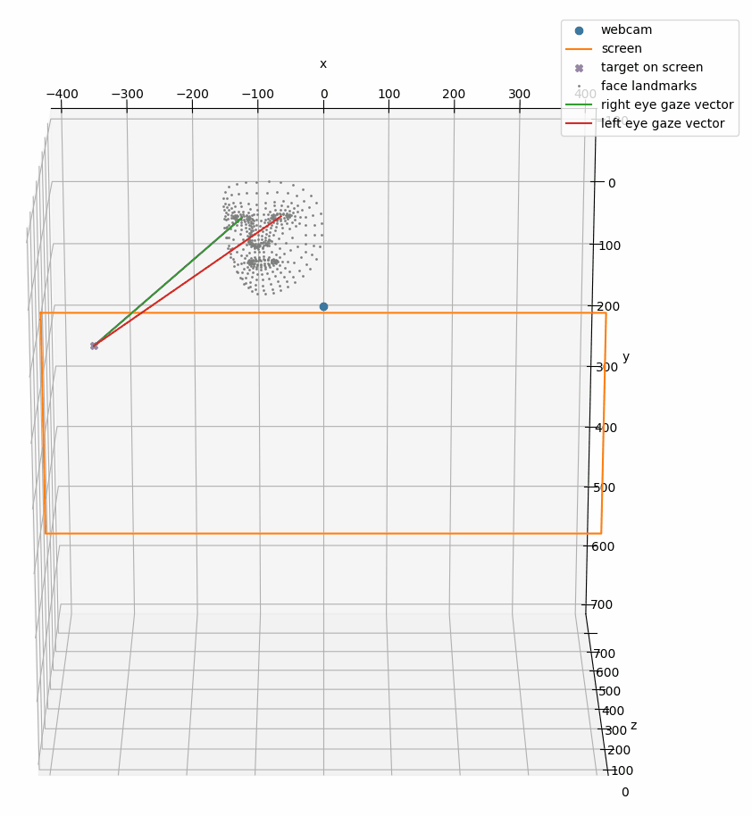

# Collect Training and Calibration Data for Gaze Tracking

This tool allows collecting gaze data necessary for personal calibration or training of eye-tracking models. It was developed as part of my master's thesis on [eye tracking with a monocular webcam](https://github.com/pperle/gaze-tracking).
The [framework for the full gaze tracking pipeline](https://github.com/pperle/gaze-tracking-pipeline) is also available.

The output is a folder with a CSV file containing the target that the person is looking at in pixels and the file name of the associated webcam image. For good calibration results, it is recommended to take at least 9 calibration images, the more, the better.

## How to run

1. `pip install -r requirements.txt`
2. If necessary, calibrate the camera using the provided interactive script `python calibrate_camera.py`, see [Camera Calibration by OpenCV](https://docs.opencv.org/4.5.3/dc/dbb/tutorial_py_calibration.html).
3. For higher accuracy, it is also advisable to calibrate the position of the screen as described by [Takahashiet al.](https://doi.org/10.2197/ipsjtcva.8.11), which provide an [OpenCV and matlab implementation](https://github.com/computer-vision/takahashi2012cvpr).
4. `python main.py --base_path=./data/p00`
   1. This was only tested on Ubuntu 20.10 and Ubuntu 21.04. If you are using macOS or Windows, you might have to supply the monitor parameters manually, e.g., `--monitor_mm=750,420 --monitor_pixels=1920,1080`, and adjust the `TargetOrientation` values in `utils.py`.
5. Look at the screen and press the corresponding arrow key where the letter `E` is pointing at when the letter color changes from blue to orange. Please press the arrow key several times because sometimes OpenCV doesn't register the click the first time.
6. Press the `q` key when the data collection is complete.

7. Visualize the recorded data, image by image by running `python visualization.py --base_path=./data/p00`.

